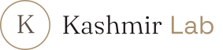

<br>
<p align="center">
  <picture>
    <source media="(prefers-color-scheme: dark)" srcset="docs/logos/svg/logo-full/kl-logo-full_md_dark.svg">
    <source media="(prefers-color-scheme: light)" srcset="docs/logos/svg/logo-full/kl-logo-full_md_light.svg">
    
  </picture>
</p>

<p align="center"><em>Anima nella tecnologia.</em></p>

<p align="center">
  
  
  
</p>

---

> **εἶδος** · eidos · /ˈei̯.dos/ — _forma, essenza, idea visibile. L'aspetto esteriore in cui si manifesta la natura di qualcosa._

Visual and verbal identity of Kashmir Lab.
This repository hosts the brand system — served as static pages via GitHub Pages.

### Pages

|                                                             |                                                     |
| :---------------------------------------------------------- | :-------------------------------------------------- |
| **[Identity](https://kashmirlab.github.io/eidos/identity)** | Brand codex — chi siamo, come ci esprimiamo, perché |
| **[Logos](https://kashmirlab.github.io/eidos/logos)**       | Marchio, varianti, formati, regole d'uso            |

### Structure

```
docs/
├── identity/
│   └── index.html
└── logos/
    ├── index.html
    └── svg/
        ├── circle-k/
        ├── logo-compact/
        ├── logo-full/
        └── wordmark/
```

### Framework

> _Richness focused by restraint, simplicity imbued with warmth. Soft Minimalism._

---

<p align="center">
  <sub><em>Kashmir Lab</em></sub>
</p>
